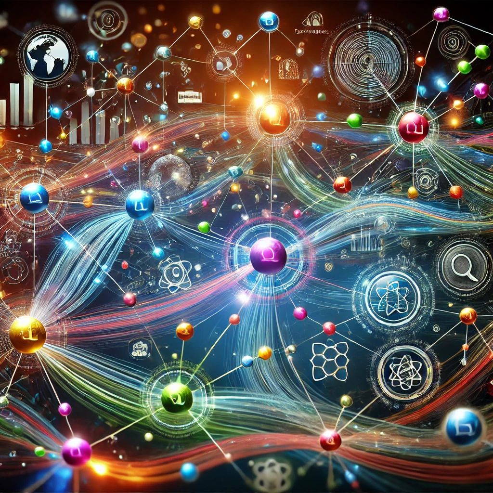
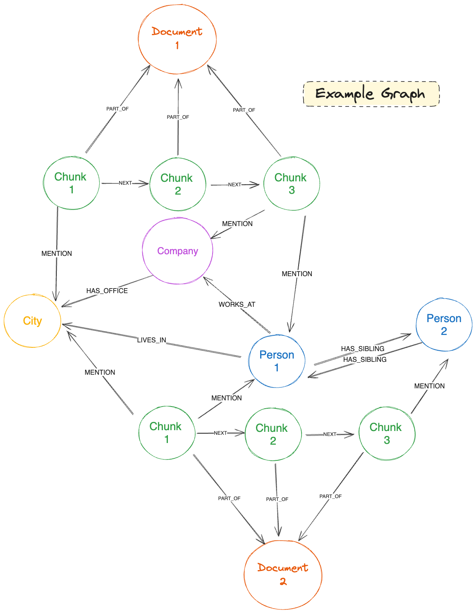
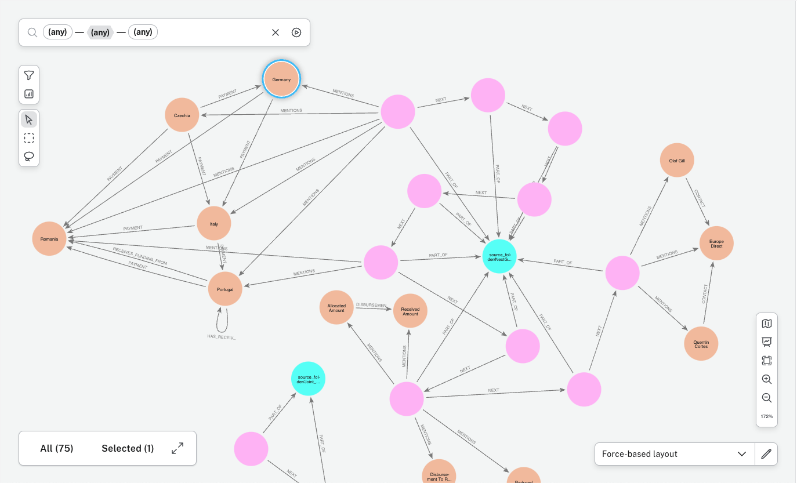
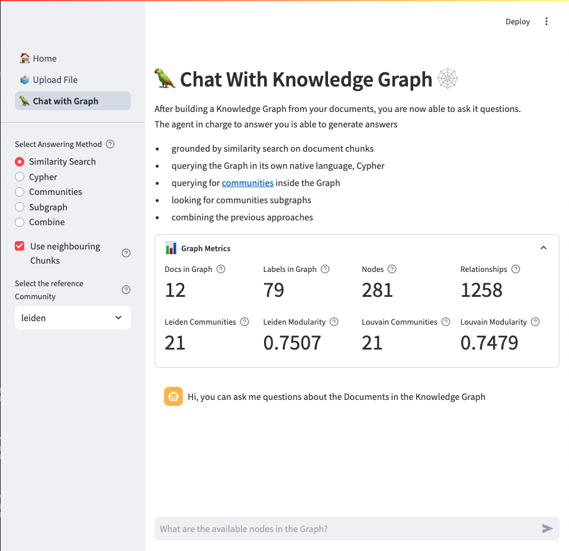
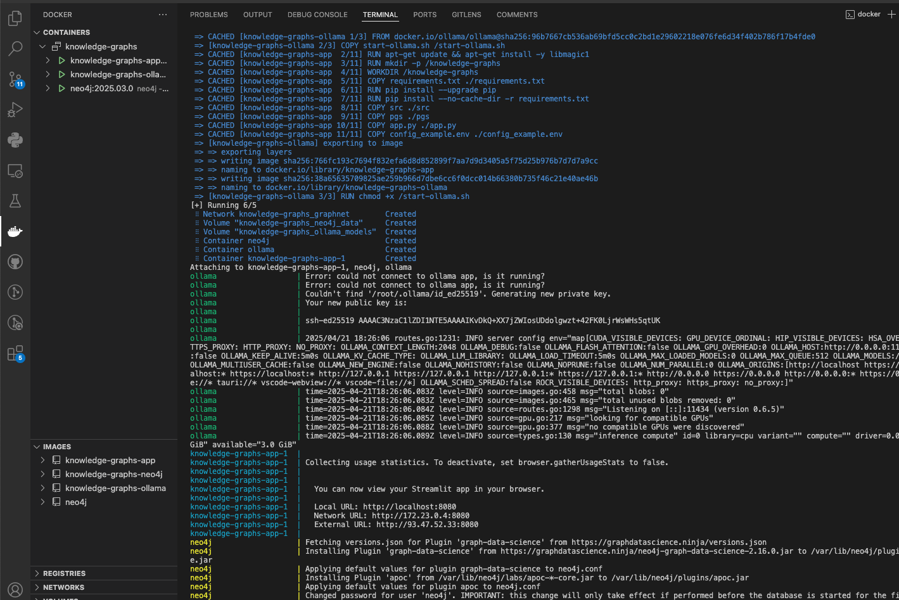

# Knowledge Graphs 
> ℹ️ last updated April 21, 2025.  



This is a work in progress repository where I collect my experiments on building software for RAG applications based on Knowledge Graphs. 

What is currently provided is:
* source code
* example notebooks written while building the repo
* a Streamlit app to showcase work done until this point
* Docker files to built the image(s) for this project without having to manually install Neo4j and Ollama

## What is a Knowledge Graph?
A Knowledge Graph is a structured representation of information that connects concepts, entities, and their relationships in a way that mimics human understanding. It is often used to organize and integrate data from various sources, enabling machines to reason, infer, and retrieve relevant information more effectively.

> 💡 To have a clearer insight on the relevance of Knowledge Graphs, I've written a [Medium Post](https://medium.com/p/fc0b9dc1602c). Feel free to check it out. 

The key features of Knowledge Graphs can be divided in:

* Entities (Nodes): represent real-world objects like people, places, organizations, or abstract concepts;
* Relationships (Edges): define how entities are connected between them (i.e: “Bill → WORKS_AT → Microsoft”);
* Attributes (Properties): provide additional details about entities (e.g., Microsoft’s founding year, revenue, or location) or relationships ( i.e. “Bill → FRIENDS_WITH {since: 2021} → Mark”);
* Ontology (Schema): defines the structure and rules of the graph, ensuring consistency across the represented knowledge.



## Knowledge Graphs and LLMs
RAG applications usually works pretty well for use cases where each piece of knowledge is self-enclosed inside a single piece of text into a single document. However, vector search and hybrid search fall short in at least one regard: they do not account for relationships. This is where Graphs come into play. 

> Vector similarity alone relies on explicit mentions in the Knowledge Base (*intra-document level*), while representing Knowledge as graphs enables reasoning at a global dataset level (*inter-document level*). Combining the two approaches will result in a more cohesive and grounded retrieval process, that is becoming known as ***GraphRAG***.


## ⚙️ Configuration
In order to showcase this approach to RAG, we will need some tools. 
If you are using the Dockerized version of this app, some of them are already set up for you in the DockerFile. 
* **Neo4j**: in this demo app, [Neo4j](https://neo4j.com/) is used both as a Vector Store as well as a Graph Database; in fact, during the ingestion process, each Document is transformed in a node, and from it `Chunk` nodes are extracted (with `embeddings` as metadata for that node), while an agent is used to produce a graph representation of the content of the document. 
* **Ollama/OpenAI/Groq API**: To power agents you will need LLMs and Embeddings models. For this demo, available options are to either provide [OpenAI](https://openai.com/index/openai-api/) / [Azure OpenAI](https://azure.microsoft.com/it-it/products/ai-services/openai-service) API Key and endpoints or to have [Ollama](https://ollama.com/) installed in your machine. You could also use the [Groq Cloud](https://console.groq.com/home) API if you want to test other open weights models
* **Documents**: Documents coming from a specific domain to ingest; available formats are `.pdf`, `.docx`, `.txt`, `.html`.
* **Configuration**: in order for this Demo to work, you should either have all the settings for Neo4j, LLMs.. inside your environment or a configuration file at the following path: `knowledge-graphs/config.env`. 

### Configuration File
the configuration file should look something like this: 
````
NEO4J_URI=neo4j+s://<your_instance_id>.databases.neo4j.io
NEO4J_USERNAME=neo4j
NEO4J_PASSWORD=your_password
AURA_INSTANCEID=your_instance_id
AURA_INSTANCENAME=Instance01
INDEX_NAME=vector
TIMEOUT=5000

CHUNKER_TYPE=recursive
CHUNKER_CHUNK_SIZE=1000
CHUNKER_CHUNK_OVERLAP=100

EMBEDDINGS_TYPE=ollama
EMBEDDINGS_MODEL_NAME=mxbai-embed-large
EMBEDDINGS_API_KEY=none
EMBEDDINGS_DEPLOYMENT=none
EMBEDDINGS_ENDPOINT=none

QA_MODEL_TYPE=groq
QA_MODEL_NAME=gemma2-9b-it
QA_MODEL_TEMPERATURE=0.0
QA_API_KEY=XXXX
QA_MODEL_DEPLOYMENT=none
QA_MODEL_ENDPOINT=none
````

### Setting up Neo4j 
[Neo4j](https://neo4j.com/) is an open-source graph database with vector search capabilities. In this project, it is used as a backbone for our Knowledge Graph, where each Document is stored as a node, 
connected to nodes representing its `Chunks`. It is also used to store nodes and relationships, connected to their original's `Chunk`.  
Neo4j offers both a managed, [cloud-based experience](https://neo4j.com/product/auradb/) (with a free tier) as well as a [desktop version](https://neo4j.com/download/).  

This is what a Knowledge Graph looks like in Neo4j:


## 👑 Streamlit Web App
To showcase how the code works, a [Streamlit App](https://streamlit.io/cloud) has been built with the following pages:
* [Home](pgs/home): mostly here to help the user navigate the web app; 
* [Upload](pgs/upload.py): Upload documents into Neo4j following a pipeline of commands;
* [Chat](pgs/chat.py): Chat with the Knowledge Graph with various retrieval strategies (see the previous section).

> 💡 before running the app, ensure you have 
> * an active instance of Neo4j (either in the cloud with Aura or locally deployed)
> * API keys to access LLMs and Embeddings models (OpenAI, Ollama, Groq..)
> * a `config.env` file with your environment variables at the root of this folder

To run the app, all you need to do is to go on your terminal and run

````
pip install -r requirements.txt

streamlit run app.py
````

A new webpage pointing to your localhost will appear and you will be able to test the app for yourself.  



> ⚠ As all Streamlit apps, this should NOT be used for production use cases but it's only meant as a demo.

## 🐳 Build with Docker  


Docker is commonly used to package and containerize applications to make them ready for cloud deployment via container registries. It also helps avoiding those "works on my machine" kinda issues.    
In this repo you will find files for building the images you need for the demo, without having to install anything yourself (except for [Docker](https://www.docker.com/) of course).  
If you want to build the app "as-is" you can just go to your terminal and launch 

````
docker compose up --build
````
to build the following images (each of them can also be run on its own):

* `Dockerfile`: builds the app image and lets you run it in a isolated environment (no need to have python installed in your machine)
* `ollama.Dockerfile`: use it to containerize a Ollama version; **currently work in progress**, ollama is set to only use CPU inference
* `Neo4j`: the base image for Neo4j + additional libraries such as `APOC` and `graph-data-science`

> ⚠ Neo4j Community Edition does not support vector search natively as of now.  
> If you want to experiment with Neo4j Enterprise locally, Neo4j still allows you to run it free for dev purposes (you just have to accept the license, as you can see from the `docker-compose.yml` file).

If the command does not throw errors, you should be able to see something like this


## 🕸️ How to build a Graph 
Currently, when uploading a one or more files inside the Streamlit App (see below), each file is passed through a pipeline that will: 
1. load it into a json format;
2. cleaning its text;
3. divide its text into smaller pieces, called chunks;
4. embed each chunk into its vector representation;
5. use a LLM model to extract a graph of concepts from each chunk;
6. upload the obtained vectors and entities into the Knowledge Graph;
7. update the centralities measures and the division of the Graph into communities.

In the near future, the plan is to integrate additional (optional) steps, such as one for [entity resolution](https://en.wikipedia.org/wiki/Record_linkage) and one for [link prediction](https://en.wikipedia.org/wiki/Link_prediction) between entities. 

Step #5 is probably the less obvious one. It is performed using an agent called `GraphExtractor` that will output a structured output mimicking a `pydantic` class:

````
class _Node(Serializable):
    id: str
    type: str
    properties: Optional[Dict[str, str]] = None


class _Relationship(Serializable):
    source: str
    target: str
    type: str
    properties: Optional[Dict[str, str]] = None


class _Graph(Serializable):
    """ 
    Represents a graph consisting of nodes and relationships.  
    
    -----------
    Attributes:
    -----------
        `nodes (List[_Node])`: A list of nodes in the graph.
        `relationships (List[_Relationship])`: A list of relationships in the graph.
    """
    nodes: List[_Node]
    relationships: List[_Relationship]
````

### Ontologies
When extracting a Knowledge Graph from documents chunks, it might make sense to give the [`GraphExtractor`](src/agents/graph_extractor.py) in charge of this task an `Ontology` in the form of a `pydantic` class:  

````
class Ontology(BaseModel):
    allowed_labels: Optional[List[str]]=None
    labels_descriptions: Optional[Dict[str, str]]=None
    allowed_relations: Optional[List[str]]=None
````

Since ontologies are by definition domain-dependent, what happens when the user is not a SME or a domain expert? 

My suggestion is to use another Agent called [`OntologyExplorer`](src/agents/ontology_explorer.py) to infer the ontology of the domain from a subset of chunks; the output of this agent will be one of the inputs for the `GraphExtractor`.

## 🦜 How to Chat with the Graph
Once documents are uploaded inside the Knowledge Graph, the user can query it using the [`GraphAgentResponder`](src/agents/graph_qa.py). Under the hood, we have a basic agent that runs via LLM / Embeddings API calls and has many available strategies to traverse the graph. 

### Retrieval Strategies
The `GraphAgentResponder` has many strategies at its disposal to query and traverse the Knowledge Graph to answer the user's query.  
Here is a comparison table with available options. 

| Method | Description | Token Usage | Latency | Params | Performances |
|--------|-------------|-------------|---------|--------|--------------|
| `answer_with_cypher` | Uses only the Cypher chain to answer the user's question | Medium | Low | `intermediate_steps` | Higher the better the schema of the graph is defined |
| `answer_with_context` | Uses only vanilla RAG to answer the user's question.  If `use_adjacent_chunks=True` will query the graph for additional context compared to the Chunks retrieved by the similarity search | Low | Low | `use_adjacent_chunks` | Depends on the quality of the Chunks and by how self-enclosed is the question |
| `answer_with_community_reports` | Queries two vector indexes to get the user's answer out of an ensemble of contexts: one made of a list of `CommunityReport` and one made of a list of `Chunk` from the same communities of the reports. If `use_adjacent_chunks=True` will query the graph for additional context compared to the Chunks retrieved by the similarity search | Medium | Low / Medium | `use_adjacent_chunks`, `community_type` | Enhanced Similarity Search, performances vary on the attention window of the LLM |
| `answer_with_community_subgraph` | Answers after querying for communities: (i) read the most relevant community reports (ii) fetch Chunks belonging to the most relevant community (iii) follow the MENTIONS relationship of each Chunk (iv) fetch the community subgraph (v) passes the subgraph + Chunks + the report to a reconciler agent to decide how to answer | High | Medium | `community_type` | Performances vary on the attention window of the LLM; might get chaotic | 
| `answer` | Answers the user query performing text generation after having retrieved context both via Vector Search and Cypher Queries. Results from both this methods are synthetized in a comprehensive answer | High | High | `use_adjacent_chunks`, `filter` | Generally the best (most on point) answering strategy. Might Get complicated for smaller models to handle the complexity|

## ❓ Support
This app currently offers various options for LLM and Embeddings deployment; since this is built mostly for fun, I am currently using Ollama and Groq models.   

**Embeddings**: 
* [Ollama](https://ollama.com/), 
* [OpenAI](https://platform.openai.com/docs/overview) / [AzureOpenAI](https://azure.microsoft.com/en-us/products/ai-services/openai-service)
* [Hugging Face](https://huggingface.co/) 

**Large Language Models**:
* [Ollama](https://ollama.com/)
* [OpenAI](https://platform.openai.com/docs/overview) / [AzureOpenAI](https://azure.microsoft.com/en-us/products/ai-services/openai-service)
* [Hugging Face](https://huggingface.co/) 
* [Groq Cloud](https://console.groq.com/home)
